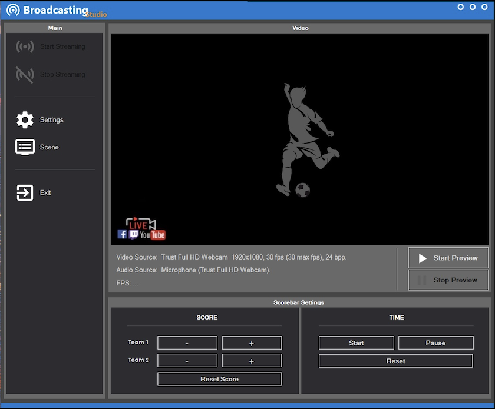

Broadcast Sport
==========================
As a graduate project I built a sports streaming platform which was used to expand the functionality of my university's proprietary platform, and which is used to broadcast sports tournaments between universities. 
This application allows you to stream a game and show the score in a bar that can be customized.

## Features
* C#
* .Net
* FFmpeg
* WinForms
* Fully customizable scorebar (Drag&Drop images)
* RTMP (YouTube, Facebook, Twitch, Instagram)
* Multithreading
* ConcurrentQueue

## Screenshots

# Requirements 

* Windows 10
* FFmpeg

